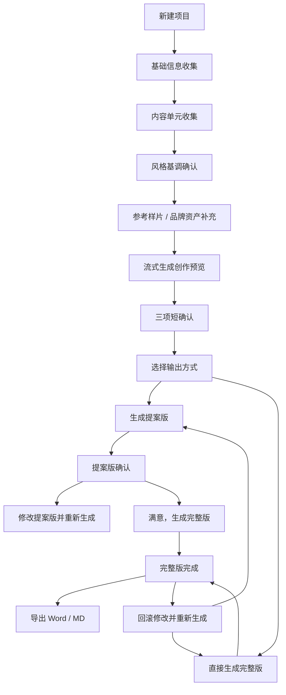

# AI 导演分镜助手 UI 需求文档

## 1. 文档目标

本文档面向 UI / UX 设计同事，用于重新设计“AI 导演分镜助手”的 Web 产品界面。

产品目标是把分镜脚本 skill 做成一个接近 DeepSeek / Codex 对话体验的创作工具：用户通过多轮引导式对话完成项目信息收集、创作方向确认、提案版生成、完整版生成、导出和后续改稿。

本轮 UI 设计重点不是营销官网，而是一个可直接使用的工作台。

## 2. 产品定位

产品名称：AI 导演分镜助手

核心用户：

- 视频策划
- 编导
- 传媒公司项目经理
- 企业宣传片销售 / 提案人员
- 需要快速生成宣传片分镜脚本的内容团队

核心价值：

- 用聊天式交互降低分镜策划门槛
- 用引导式下拉框帮助用户表达需求
- 先生成提案版，用于客户沟通
- 再生成完整版，用于制作执行
- 支持导出 Markdown 和 Word
- 支持后续客户反馈后的改稿和回滚

## 3. 整体界面结构

推荐采用类似 DeepSeek 的三段式布局。

### 3.1 左侧历史栏

用途：

- 展示历史项目
- 新建项目
- 删除项目
- 点击历史项目恢复完整对话和当前进度

建议宽度：

- 桌面端：240px - 280px
- 移动端：默认隐藏，通过顶部“历史”按钮打开抽屉

左侧内容：

- 顶部标题：分镜项目
- 新建项目按钮
- 历史项目列表
- 每条历史项目包含：
  - 项目名称
  - 影片类型
  - 更新时间
  - 删除按钮

历史项目状态建议：

- 草稿
- 创作预览
- 提案版
- 完整版
- 已导出

视觉要求：

- 历史栏固定，不随中间对话滚动
- 字体不要过大，项目标题建议 13px - 14px
- 当前项目需要有高亮状态
- 删除按钮不应过于抢眼，hover 时再强调危险色

### 3.2 中间主聊天区

用途：

- 展示 AI 导演消息
- 展示用户回复摘要
- 展示流式生成内容
- 展示当前阶段的操作表单

布局要求：

- 主聊天区居中
- 不要铺满整个右侧屏幕
- 桌面端建议最大宽度 960px - 1080px
- 右侧可留白，但不要过大
- 消息气泡宽度建议不超过主内容区 85%

消息类型：

- AI 导演消息
- 用户消息
- 流式生成消息
- 错误提示消息
- 状态提示

视觉建议：

- AI 消息左对齐
- 用户消息右对齐
- 用户消息使用品牌主色
- AI 消息使用浅色背景
- 长文档内容需要适合阅读，行高建议 1.6
- Markdown 内容中的表格需要支持横向滚动

### 3.3 顶部工具区

用途：

- 展示产品标题
- 展示模型配置状态
- 提供当前版本导出按钮

顶部内容：

- 产品名：AI 导演分镜助手
- 副标题：像 Codex 对话一样确认方向，最后生成提案版和完整版
- 模型状态：
  - 模型已配置 · glm-5.1
  - 模型未配置
- 导出按钮：
  - 导出提案版 MD
  - 导出提案版 Word
  - 导出完整版 MD
  - 导出完整版 Word

按钮显示规则：

- 未生成任何正式文档时，导出按钮禁用
- 当前处于提案版阶段时，顶部优先显示提案版导出
- 当前处于完整版阶段时，顶部优先显示完整版导出
- 底部操作区也需要提供更明确的版本化导出按钮

### 3.4 底部输入 / 操作区

用途：

- 根据当前流程阶段显示对应表单
- 提供下拉框、文本框和继续按钮
- 支持改稿意见输入

要求：

- 始终位于主聊天区底部
- 当前阶段只展示当前需要用户操作的内容
- 不要一次性展示所有表单
- 每一步提交后，聊天区只追加用户回复摘要，不要回显过长全文

## 4. 完整业务流程

整体流程分为 8 个阶段。



## 5. 详细交互阶段

### 5.1 阶段一：基础信息收集

AI 提示：

> 我们按交互式分镜策划来。先告诉我片子的基本信息，我会一步步追问，信息足够后再生成文档。

表单字段：

- 项目名称
- 客户类型
- 影片类型
- 成片时长
- 成片比例

字段建议：

客户类型下拉：

- 企业
- 政府
- 消费者
- 学校
- 景区

影片类型下拉：

- 宣传片
- 产品片
- 案例片
- 文旅片
- 招商片
- 汇报片

时长下拉：

- 30秒
- 1分钟
- 3分钟
- 5分钟

比例下拉：

- 16:9 横版
- 9:16 竖版
- 1:1 方版
- 横竖版都要

提交按钮：

- 继续

验收标准：

- 用户必须填写项目名称后才能继续
- 提交后聊天区追加用户填写摘要
- 进入内容单元收集阶段

### 5.2 阶段二：内容单元收集

AI 提示：

> 好，现在请补充内容单元。可以先选一个模板，我会自动填入示例，你再改成自己的内容。

表单字段：

- 内容单元模板下拉
- 内容单元文本框

模板下拉：

- 不使用模板，自由输入
- 企业宣传片
- 产品片
- 案例片
- 文旅片
- 设计服务
- 智能制造
- 政务汇报

选择模板后：

- 自动填充示例内容到文本框
- 用户可以继续编辑

内容单元文本框示例：

```text
Logo制作：品牌识别、图形推演、字体色彩
海报设计：活动海报、产品海报、社媒传播
视觉延展：名片、门头、展架、物料统一
服务流程：需求沟通、创意提案、设计打磨、交付应用
```

验收标准：

- 至少填写一个内容单元才能继续
- 提交后聊天区追加内容单元摘要
- 进入风格基调确认阶段

### 5.3 阶段三：风格基调确认

AI 提示：

> 接下来确认风格基调。你可以直接从下拉框选，也可以补一句更具体的感觉。

字段：

- 风格基调下拉
- 补充偏好输入框

风格基调下拉：

- 年轻创意、反套路
- 高端专业、商业质感
- 科技感、未来感
- 真实纪实、温暖服务
- 政务感、稳重可信
- 电影感、情绪化

补充偏好示例：

```text
节奏更快，不要传统企业宣传片口吻。
```

验收标准：

- 必须选择或填写风格后才能继续
- 提交后聊天区追加风格摘要
- 进入参考样片和品牌资产阶段

### 5.4 阶段四：参考样片和品牌资产

AI 提示：

> 最后补充参考样片和品牌资产。没有也没关系，我会根据项目定位推荐参考方向。

字段：

- 参考样片文本框
- 品牌资产文本框

参考样片：

- 可填写链接
- 可填写描述
- 可留空

品牌资产：

- Logo
- VI
- 现有宣传片
- 产品图
- 海报
- 案例素材
- 可留空

验收标准：

- 可以留空继续
- 提交后聊天区追加用户摘要
- 进入创作预览阶段

### 5.5 阶段五：流式生成创作预览

AI 提示：

> 我先生成一份“创作预览与确认项”，包括主推主题、主推口号和备选口号。你确认后我再生成正式文档。

按钮：

- 生成创作预览

生成方式：

- 必须流式输出
- 生成过程中按钮显示“生成中...”
- 生成过程中禁止重复点击

创作预览内容应包含：

- 当前信息归纳
- 推荐内容逻辑
- 暂定创意主题
- 暂定主推口号
- 备选口号表
- 下一步确认提示

验收标准：

- 生成内容逐字 / 分段流式出现
- 生成完成后进入三项短确认
- 不直接生成完整文档

### 5.6 阶段六：三项短确认

创作预览完成后，不要重复展示全文，只做短确认。

#### 5.6.1 口号确认

字段：

- 口号选择下拉
- 补充修改意见

下拉选项：

- 使用主推口号
- 口号 1
- 口号 2
- 口号 3
- 口号 4
- 我写了自定义意见

提交按钮：

- 确认口号，继续下一项

#### 5.6.2 创意方向确认

字段：

- 整体创意方向下拉
- 补充修改意见

下拉选项：

- 沿用预览方案
- 主题保留，叙事更直接
- 主题保留，视觉更大胆
- 整体更商业获客
- 整体更高级克制
- 我写了自定义意见

提交按钮：

- 确认创意，继续下一项

#### 5.6.3 成片套餐 / 表达尺度确认

字段：

- 成片套餐 / 表达尺度下拉
- 补充修改意见

下拉选项：

- 标准完整分镜
- 完整分镜 + 镜号 + 画面描述 + 参考导向
- 完整分镜 + 声音设计 + 执行难点预警
- 更强 Meta 叙事，轻微反套路
- 更克制，减少 Meta 和吐槽感

提交按钮：

- 完成确认

验收标准：

- 三项确认按顺序进行
- 每次提交后只追加用户选择摘要
- 不重复回显创作预览全文
- 三项完成后进入输出方式选择

### 5.7 阶段七：输出方式选择

AI 提示：

> 三项确认完成。请选择接下来的输出方式。推荐先生成提案版，确认后再生成完整版。

字段：

- 输出方式下拉

下拉选项：

- 先生成提案版，确认后再生成完整版
- 直接生成完整版

说明文案：

> 提案版用于先说服客户和决策者；完整版会额外补充拍摄执行、难点预警和交付分工。

验收标准：

- 默认选择“先生成提案版，确认后再生成完整版”
- 选择提案版后进入提案版生成阶段
- 选择直接完整版后进入完整版生成阶段

## 6. 提案版流程

### 6.1 生成提案版

按钮：

- 开始生成提案版

生成方式：

- 必须流式输出
- 生成中禁用重复提交

提案版定位：

- 不是摘要
- 不是短版
- 是可以给客户 / 老板 / 甲方沟通的正式提案文档

提案版应包含：

- 项目信息与提案目标
- 创意策略
- 核心表达
- 暂定宣传口号与备选口号
- 成片价值
- 视觉风格设定
- 音乐音效设计
- 总旁白
- 分段文案
- 分镜脚本表
- 提案版总结

提案版不应包含：

- 拍摄方式建议
- 执行难点预警
- 交付分工建议

验收标准：

- 提案版内容完整流式输出
- 生成完成后显示提案版操作区

### 6.2 提案版操作区

提案版生成后显示：

- 导出提案版 MD
- 导出提案版 Word
- 满意，生成完整版
- 不满意，修改提案版

### 6.3 不满意，修改提案版

点击后展开修改表单。

字段：

- 修改方向下拉
- 具体修改意见文本框

修改方向下拉：

- 强化创意策略和提案说服力
- 口号和主题再年轻一点
- 整体表达更高端专业
- 减少抽象概念，画面更落地
- 旁白更有记忆点
- 分镜画面更丰富
- 按我的自由意见修改

具体修改意见 placeholder：

```text
例如：客户觉得口号太轻，想更突出专业可信；分镜画面减少抽象转场，多给实际服务场景。
```

提交按钮：

- 按修改意见重新生成提案版

验收标准：

- 提交后聊天区追加用户修改摘要
- 系统带着修改意见重新流式生成提案版
- 重新生成后仍回到提案版操作区
- 如果此时之前已有完整版，重新生成提案版后应视为完整版失效，需要重新生成完整版

## 7. 完整版流程

### 7.1 生成完整版

触发方式：

- 用户在提案版操作区点击“满意，生成完整版”
- 用户在输出方式阶段选择“直接生成完整版”

按钮：

- 开始生成完整版

生成方式：

- 必须流式输出
- 生成中禁用重复提交

完整版应包含：

- 项目信息与执行假设
- 参考样片方向分析
- 内容逻辑选择
- 创作前提
- 创意主轴
- 总旁白
- 段落文案
- 分镜脚本表
- 拍摄方式建议
- 执行难点预警
- 交付分工建议
- 统一表达归纳
- 可拆条版本建议

验收标准：

- 如果已有提案版，完整版应尽量沿用提案版创意和文案
- 重点补充执行层内容
- 生成完成后显示完整版操作区

### 7.2 完整版操作区

完整版生成后显示：

- 导出完整版 MD
- 导出完整版 Word
- 回滚修改

说明文案：

> 现在可以分别导出完整版 Word 或 MD。后续客户要改稿时，可以从这里回滚修改并重新生成。

### 7.3 回滚修改

点击后展开修改表单。

字段：

- 修改方向下拉
- 具体修改意见文本框

修改方向下拉：

- 补充拍摄执行细节
- 分镜表更细，增加镜头数量
- 降低执行难度，更容易拍
- 声音设计和字幕更明确
- 交付分工更清楚
- 整体回到提案版重新调整
- 按我的自由意见修改

具体修改意见 placeholder：

```text
例如：客户希望镜头更容易执行，减少复杂运动镜头；或者整体回到提案版，把创意主题调整得更稳重。
```

提交按钮：

- 按修改意见重新生成

交互规则：

- 如果选择普通完整版修改方向，则重新生成完整版
- 如果选择“整体回到提案版重新调整”，则重新生成提案版，并清空当前完整版状态
- 重新生成后需要保留历史对话记录

验收标准：

- 完整版完成后，流程不应彻底锁死
- 用户可以继续改稿
- 每次改稿都要有用户修改摘要
- 每次重新生成仍然使用流式输出

## 8. 导出规则

导出格式：

- Markdown
- Word

导出版本：

- 提案版
- 完整版

文件命名：

```text
{项目名称}_提案版.md
{项目名称}_提案版.docx
{项目名称}_完整版.md
{项目名称}_完整版.docx
```

导出交互：

- 点击导出按钮后直接触发下载
- 不需要额外出现“下载文件”按钮
- 导出失败时在状态栏提示错误
- 导出成功时提示文件名已导出

验收标准：

- 提案版和完整版互不覆盖
- MD 和 Word 互不覆盖
- 未生成对应版本前，对应导出按钮禁用
- 导出 Word 使用后端既有 docx 逻辑，UI 不需要处理 Word 样式

## 9. 历史项目管理

### 9.1 新建项目

入口：

- 左侧“新建项目”按钮

行为：

- 清空当前输入状态
- 重置为阶段一
- 不删除历史项目

### 9.2 恢复历史项目

入口：

- 点击左侧历史项目

行为：

- 恢复项目基本信息
- 恢复聊天记录
- 恢复当前流程阶段
- 恢复提案版 / 完整版内容
- 恢复可导出状态

验收标准：

- 刷新页面后历史项目仍存在
- 点击历史项目后，聊天区显示历史对话内容
- 如果项目已经生成完整版，底部应显示完整版操作区
- 如果项目只生成提案版，底部应显示提案版操作区

### 9.3 删除历史项目

入口：

- 每条历史项目右侧删除按钮

交互：

- 点击后弹出确认
- 确认文案：

```text
确定删除“项目名称”吗？相关导出的 MD 和 Word 也会一起删除。
```

行为：

- 删除项目状态
- 删除导出的 MD / Word 文件
- 从历史列表移除
- 如果删除的是当前打开项目，则回到新建项目状态

验收标准：

- 删除前必须确认
- 删除后历史列表立即刷新
- 删除按钮视觉上不要过度抢眼

## 10. 状态和异常提示

状态栏建议放在底部输入区下方。

常见状态：

- 准备就绪
- 处理中...
- 正在流式生成创作预览...
- 正在流式生成提案版...
- 正在流式生成完整文档...
- 提案版已生成，可以导出或继续生成完整版。
- 完整文档已生成，可以导出 Word 或 MD。
- 提案版已按修改意见重新生成。
- 完整版已按修改意见重新生成。
- 历史项目已删除。
- 导出失败
- 生成失败
- 模型未配置

异常处理：

- 模型未配置时，生成按钮禁用
- 生成失败时，不清空用户已填写内容
- 导出失败时，不清空生成内容
- 删除失败时，不从前端列表移除

## 11. 视觉设计要求

整体方向：

- 年轻
- 专业
- 清晰
- 工作台感
- 不要营销 landing page

参考体验：

- DeepSeek 的历史栏 + 主对话结构
- Codex 的多轮引导式确认

不建议：

- 大面积营销 banner
- 复杂渐变背景
- 过宽的对话区
- 右侧无意义预览面板
- 多个卡片套卡片
- 一次性展示所有表单

颜色建议：

- 主色可使用偏青绿色或专业蓝绿色
- 背景使用浅灰 / 浅冷色
- 用户气泡使用主色
- AI 气泡使用浅色底
- 危险操作使用低饱和红色，仅 hover 或确认时强调

圆角：

- 按钮、输入框、卡片建议 8px 或更小

字体：

- 中文优先使用 Microsoft YaHei / system-ui
- 正文字号建议 14px
- 历史项目标题 13px - 14px
- 辅助信息 11px - 12px

响应式：

- 桌面端显示左侧历史栏
- 移动端历史栏变为抽屉
- 表单从双列降为单列
- Markdown 表格横向滚动，页面整体不能横向溢出

## 12. 页面验收清单

### 基础流程

- 可以新建项目
- 可以填写基础信息
- 可以选择内容单元模板
- 可以确认风格
- 可以填写参考样片和品牌资产
- 可以流式生成创作预览
- 可以完成三项短确认
- 可以选择输出方式

### 提案版

- 可以流式生成提案版
- 可以导出提案版 MD
- 可以导出提案版 Word
- 可以选择满意并生成完整版
- 可以选择不满意并填写修改意见
- 可以按修改意见重新生成提案版

### 完整版

- 可以流式生成完整版
- 可以导出完整版 MD
- 可以导出完整版 Word
- 可以回滚修改
- 可以重新生成完整版
- 可以回到提案版重新调整

### 历史项目

- 可以查看历史项目
- 可以恢复历史项目
- 可以删除历史项目
- 删除当前项目后回到新建状态

### 体验

- 生成过程是流式输出
- 生成中按钮禁用
- 历史栏固定不滚动
- 主聊天区宽度舒适
- 移动端不溢出
- 长文档和表格可阅读

## 13. 第一版设计边界

本轮 UI 不需要设计：

- 登录注册
- 多用户权限
- 计费
- 模型 API Key 配置页面
- Word 样式编辑器
- 富文本编辑器
- 在线多人协作
- 真实参考样片联网搜索

本轮 UI 需要重点做好：

- 聊天式流程
- 引导式下拉框
- 流式生成体验
- 提案版 / 完整版双版本区分
- 改稿和回滚体验
- 历史项目管理
- 清晰、稳定、好理解的工作台布局
