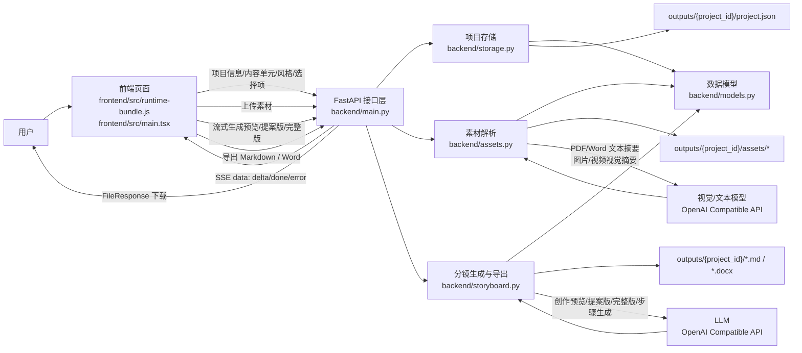
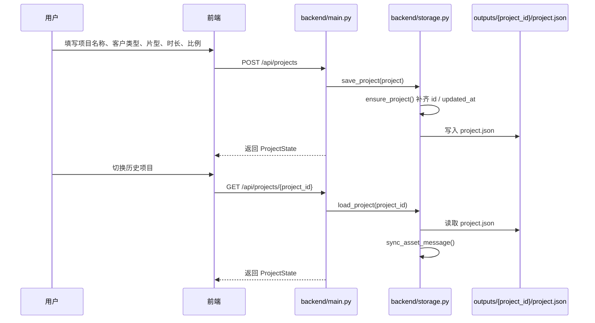
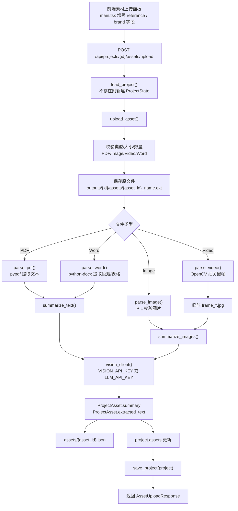
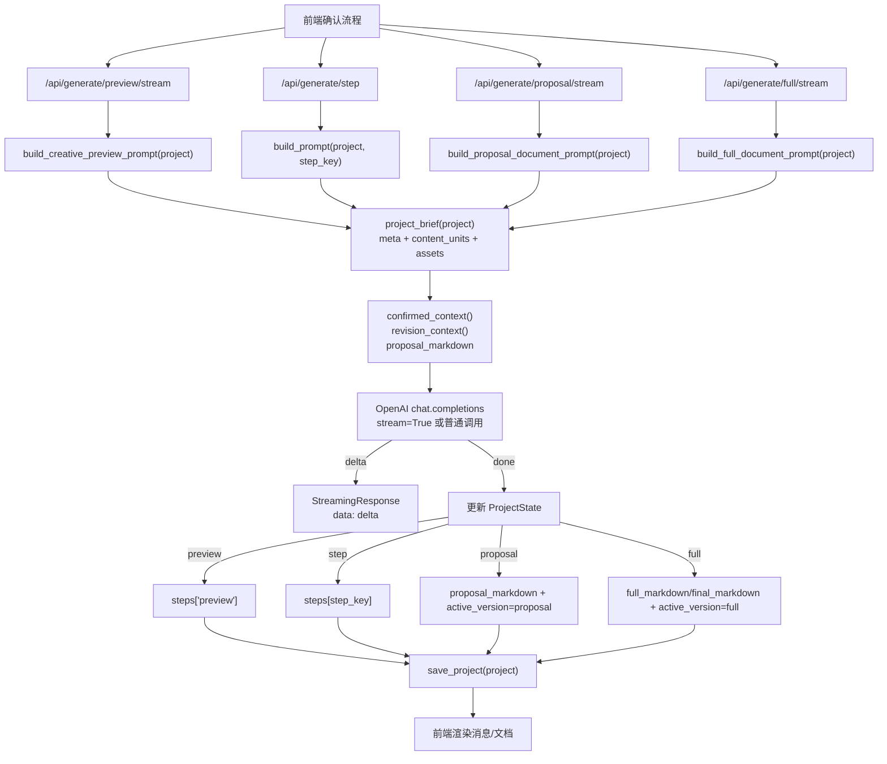
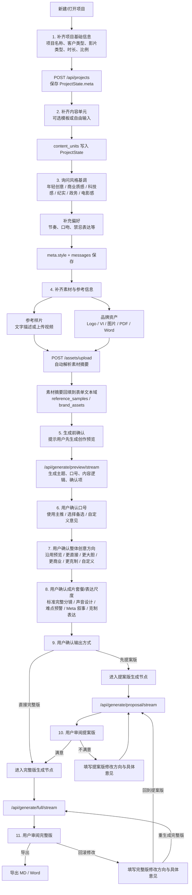
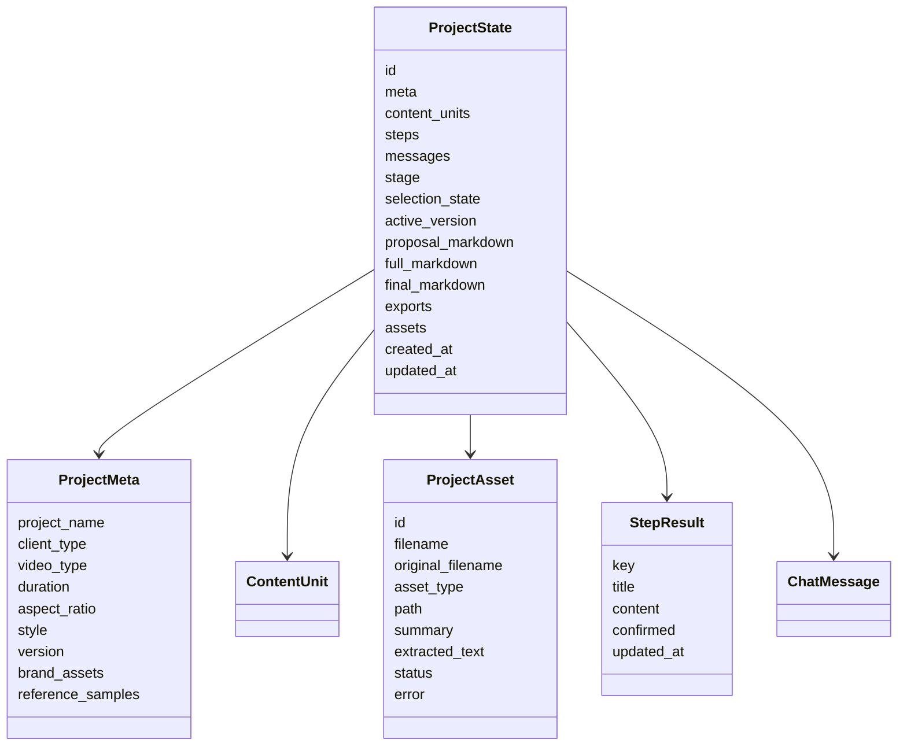

# 项目数据流转图

本文基于当前 `main` 分支代码梳理，覆盖前端页面、后端 API、素材解析、LLM 生成、项目存储与导出链路。

## 1. 总体数据流

## 2. 项目创建与状态保存

## 3. 素材上传与解析流

## 4. 分镜生成流

## 5. 文档导出流

```mermaid
flowchart LR
    FE["前端导出按钮"] --> API["POST /api/export/{version}/{kind}"]
    API --> KIND{"kind"}

    KIND -->|markdown| WM["write_markdown()"]
    KIND -->|docx| WD["write_docx()"]

    WM --> ASM["assemble_markdown()<br/>无 override 时组装 meta/content_units/steps"]
    ASM --> MDFILE["写入 outputs/{id}/{project}_{version}.md"]

    WD --> WM2["先 write_markdown()"]
    WM2 --> SCRIPT["scripts/generate_docx.py"]
    SCRIPT --> DOCX["写入 outputs/{id}/{project}_{version}.docx"]

    MDFILE --> EXP["project.exports[version_kind]"]
    DOCX --> EXP
    EXP --> SAVE["save_project(project)"]
    SAVE --> URL["返回 download_url"]
    URL --> DL["GET /api/download/{id}/export/{version}/{kind}"]
    DL --> FILE["FileResponse"]
```

## 6. 用户交互确认流程

这部分是当前产品里需要用户参与补齐、选择或确认的流程，主要由 `frontend/src/runtime-bundle.js` 中的步骤状态控制，后端负责保存项目状态、生成预览/文档、导出文件。

### 交互节点说明

| 阶段 | 用户输入/选择 | 写入位置 | 后续影响 |
|---|---|---|---|
| 项目基础信息 | 项目名称、客户类型、影片类型、时长、比例 | `ProjectState.meta` | 决定生成提示词中的项目定位与成片规格 |
| 内容单元 | 模板或自由输入的业务/产品/场景条目 | `ProjectState.content_units` | 决定分镜结构与镜头内容组织 |
| 风格基调 | 风格下拉选择与补充偏好 | `ProjectState.meta.style`、`messages` | 影响文案语气、画面风格、节奏判断 |
| 参考样片 | 文本描述或视频上传 | `meta.reference_samples`、`assets` | 影响参考风格、节奏、镜头语言 |
| 品牌资产 | 文本描述或图片/PDF/Word 上传 | `meta.brand_assets`、`assets` | 影响品牌口径、视觉元素、可用素材 |
| 创作预览 | 用户请求生成预览 | `steps["preview"]` | 先确认主题、口号、内容逻辑，避免直接生成完整稿 |
| 口号确认 | 主推口号/备选口号/自定义意见 | `steps["selection"]` | 进入提案版/完整版时作为用户最终选择 |
| 创意方向确认 | 沿用或调整整体创意 | `steps["selection"]` | 决定叙事策略和视觉表达尺度 |
| 输出方式确认 | 先提案版或直接完整版 | `active_version`、阶段状态 | 决定调用提案版还是完整版生成接口 |
| 修改反馈 | 提案版/完整版修改方向和具体意见 | `steps["revision"]` | 重生成时优先执行最新修改意见 |

## 7. 核心数据对象

## 8. 当前版本要点

- 单一项目状态文件是 `outputs/{project_id}/project.json`。
- 当前 `main` 分支没有 `backend/chat_flow.py` 对话编排入口，生成主要由 `backend/storyboard.py` 提供。
- 前端主业务来自 `frontend/src/runtime-bundle.js`，`frontend/src/main.tsx` 主要做页面增强：主题切换、侧边栏用户区、状态提示、素材上传面板。
- 素材会先被转成 `summary` / `extracted_text`，再作为 `project_brief()` 的一部分进入后续分镜生成提示词。
- 提案版和完整版分别落在 `proposal_markdown`、`full_markdown/final_markdown`，导出路径记录在 `project.exports`。
